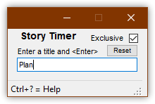
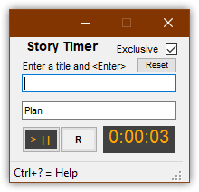

> **Important**  
> The current release *requires* installing .NET 5, which you can download from here.
> https://dotnet.microsoft.com/download/dotnet/5.0

# StoryTimer
A simple app that makes it easier to track time when task-switching. Good for supporting Scrum burn-down charts or reporting hours for billing.


## Why I Wrote It
Task-switching is a real drag, and so is time tracking. I wanted a timer that allowed me to quickly enter a new timing event, quickly switch what I was timing, easily change the time entry, and easily copy/paste info.

StoryTimer does all of that. It doesn't--and won't--have fancy features like grouping by clients and projects. It solves a common problem in a simple and flexible way.

## Usage
Open Story Timer, enter a title for the first timer and press <Enter>. The timer will be created and start immediately.





While the first timer is running, you can add a second timer and it will immediately start, while the other timer will stop.

Starting a timer will stop another active timer. This lets you switch timers as quickly as you switch contexts.

You can change the time for a timer when it's paused by entering the new time in the format H:MM:SS. Entering something else is likely to throw and error!

## Saved Times Files

**Current Times** Story Timer writes the current timers to a file named current-times.txt in the same folder as StoryTimer.exe. This can be changed in Settings (Alt+S).

**Previous Times** When Reset is pressed, Story Timer writes the timers to a file named previous-times.txt in the same folder as StoryTimer.exe. This can be changed in Settings (Alt+S).

## Copy/Paste
Press Ctrl+Shift+C to copy all timer information to the clipboard. Here's an example output.

```text
0:17:22 client meeting  
3:42:57 Story 52233 WebApi unit tests  

4:00:19 TOTAL  
```

If you copy the time entry text and, in Story Timer, press Control+Shift+V, timers will be created with the information.

Press Alt+Shift+C to copy all timers rounded to their nearest quarter hour.

```text
00.25 client meeting  
03.75 Story 52233 WebApi unit tests  

04.00 TOTAL  
```

## Settings

### Main Window
**Exclusive**  When checked, only one timer at a time is running. When unchecked, multiple timers can be running.

### Settings Window 
Press Alt-S to open the Settings window. From here you can change the name and location of the current and previous times logs.


## Help
Press Control+? to display the help screen and version number.

