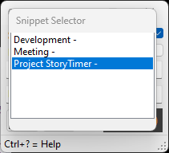
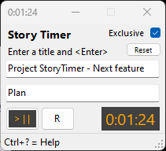
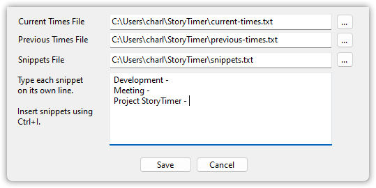

# StoryTimer
A simple app that makes it easier to track time when task-switching. Good for supporting story actual hours, Scrum burn-down charts, or reporting hours for billing.


## Why I Wrote It
Task-switching is a real drag, and so is time tracking. I wanted a timer that allowed me to quickly enter a new timing event, quickly switch what I was timing, easily change the time entry, and easily copy/paste info.

StoryTimer does all of that. It doesn't--and won't--have fancy features like grouping by clients and projects. It solves a common problem in a simple and flexible way.

It's unabashedly an "engineer's tool," but it's reasonably easy for non-engineers to install and use, too.

## Installation

1.  Install the .NET Desktop Runtime if not already installed. https://dotnet.microsoft.com/download/dotnet/7.0
1.  Download the latest version's zip file from [Releases](https://github.com/bladewolf55/StoryTimer/releases/latest).
1.  Unzip and double-click `StoryTimer.exe` to run.

To upgrade:
1.  Close Story Timer
1.  Download latest, unzip, and replace

> For now, I don't plan to include the .NET Runtime in the executable because of the extra size. 

## Usage
Open Story Timer, enter a title for the first timer and press <Enter>. The timer will be created and start immediately.


While the first timer is running, you can add a second timer and it will immediately start, while the other timer will stop.

Starting a timer will stop another active timer. This lets you switch timers as quickly as you switch contexts.

You can change the time for a timer when it's paused by entering the new time in the format H:MM:SS. Entering something else is likely to throw and error!

## Staring a New Timer From Copied Text
You have two options for starting a new timer from copied text.

1. Ctrl-V to paste the copied text into the new timer text box, then press <Enter> like normal.
1. Alt-V to create and start a new timer with the copied text.

> **Note**  
> Story Timer's titles don't accept line breaks, so if you copy text with line breaks, they're stripped out when you paste.

## Saved Times Files

**Current Times** Story Timer writes the current timers to a file named current-times.txt in the same folder as StoryTimer.exe. The file location can be changed in Settings (Alt+S).

**Previous Times** When Reset is pressed, Story Timer writes the timers to a file named previous-times.txt in the same folder as StoryTimer.exe. The file location can be changed in Settings (Alt+S).

## Copy/Paste Times
Press Ctrl+Shift+C to copy all timer information to the clipboard. Here's an example output.

```text
0:17:22 client meeting  
3:42:57 Story 52233 WebApi unit tests  

4:00:19 TOTAL  
```

If you copy the time entry text and, in Story Timer, press Control+Shift+V, timers will be created with the information.

Press Alt+Shift+C to copy all timers rounded to their nearest quarter hour.

```text
00.25 client meeting  
03.75 Story 52233 WebApi unit tests  

04.00 TOTAL  
```

## Snippets
In Settings you can add snippets of text. When your cursor is in a timer title--typically the new timer text box--press Ctrl+I, select a snippet, press <Enter>, and the snippet is copied to the text box. It's also copied to the clipboard.

Press Esc to close the snippet selector without copying anything.






## Settings

### Main Window
**Exclusive**  When checked, only one timer at a time is running. When unchecked, multiple timers can be running.

### Settings Window 
Press Alt-S to open the Settings window. From here you can change the name and location of the current and previous times logs, and the snippets file.

> **Note**  
> If you manually enter a path, Story Timer will attempt to create that path and will throw an error if it can't. This might lead to an invalid `appconfig.json` file. If so, manually edit `appconfig.json` to point to valid file paths.



## Help
Press Control+? to display the help screen and version number.

