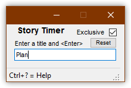
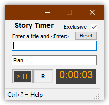

# StoryTimer
A simple app that makes it easier to track time when task-switching. Good for supporting Scrum burn-down charts.

## Usage
Open Story Timer, enter a title for the first timer and press <Enter>. The timer will be created and start immediately.





While the first timer is running, you can add a second timer and it will immediately start, while the other timer will stop.

Starting a timer will stop another active timer. This lets you switch timers as quickly as you switch contexts.

## Saved Times File
Story Timer writes the current timers to a file named current-times.txt in the same folder as StoryTimer.exe.

## Copy/Paste
Press Control+Shift+C to copy all timer information to the clipboard. Here's an example output.

```text
0:05:29  Plan
0:02:02  Meeting
```

If you copy that text and, in Story Timer, press Control+Shift+V, timers will be created with the information.

## Settings
> Today, Story Timer always starts with the same settings. In a future release, application settings and common settings like window position and size will be save.

**Exclusive**  When checked, only one timer at a time is running. When unchecked, multiple timers can be running.

## Help
Press Control+? to display the help screen and version number.

